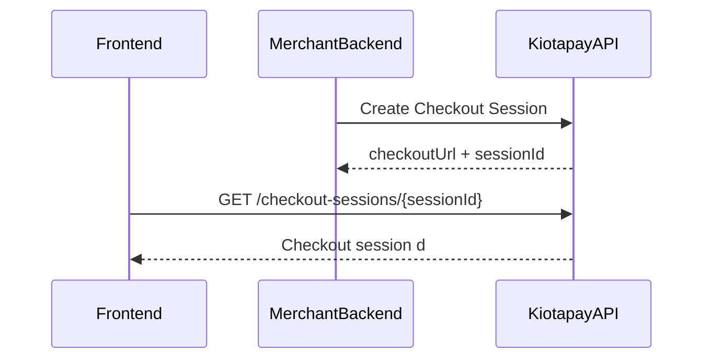

# Get Checkout Session

Retrieve the details of an existing checkout session. This endpoint is typically used by frontend applications to load the checkout page data using the session ID.

---

## Endpoint

`GET https://api.kiotapay.co/api/sandbox/v1/checkout-sessions/{checkoutSessionId}`

Example:

`GET https://api.kiotapay.co/api/sandbox/v1/checkout-sessions/cf488410-37d5-4dba-9b27-8d74f3ad8ae4`

---

## Authentication

Send your bearer token in the `Authorization` header.

```bash
Authorization: Bearer <your_access_token>
```

---

## Headers

<ParamField header="Authorization" type="string" required>
Bearer token used to authenticate your API request.
</ParamField>

---

## Path parameters

<ParamField path="checkoutSessionId" type="uuid" required>
The public checkout session ID returned when creating the checkout session.
</ParamField>

---

## Example request

```bash
curl --location 'https://api.kiotapay.co/api/sandbox/v1/checkout-sessions/cf488410-37d5-4dba-9b27-8d74f3ad8ae4' \
--header 'Device-Id: example-my-device-id' \
--header 'Authorization: Bearer <your_access_token>'
```

---

## Example response

```json
{
  "id": "cf488410-37d5-4dba-9b27-8d74f3ad8ae4",
  "amount": 1500,
  "currency": "KES",
  "description": "Payment for order #12345",
  "customerEmail": "customer@example.com",
  "customerMsisdn": "+237612345678",
  "externalRef": "ORDER-12345-EXT",
  "paymentMethods": ["CARD", "MPESA_STK"],
  "merchantDisplayName": "Example Store",
  "merchantLogoUrl": "https://cdn.example.com/logo.png",
  "status": "PENDING"
}
```

---

## Response fields

<ParamField body="id" type="uuid">
Public checkout session identifier.
</ParamField>

<ParamField body="amount" type="number">
Amount to be paid in the specified currency.
</ParamField>

<ParamField body="currency" type="string">
Three-letter currency code (ISO format). Example: `KES`.
</ParamField>

<ParamField body="description" type="string">
Description of the payment or order.
</ParamField>

<ParamField body="customerEmail" type="string">
Customer email associated with the checkout session.
</ParamField>

<ParamField body="customerMsisdn" type="string">
Customer phone number in international format.
</ParamField>

<ParamField body="externalRef" type="string">
Merchant-provided reference such as an order ID.
</ParamField>

<ParamField body="paymentMethods" type="array[string]">
List of allowed payment methods for this checkout session.
</ParamField>

<ParamField body="merchantDisplayName" type="string">
Display name of the merchant shown on the hosted checkout page.
</ParamField>

<ParamField body="merchantLogoUrl" type="string">
Logo URL displayed on the checkout page.
</ParamField>

<ParamField body="status" type="enum">
Current checkout session status.
</ParamField>

---

## Typical usage

This endpoint is usually called by the hosted checkout frontend to load session information such as:

* amount
* merchant branding
* supported payment methods
* checkout status

This ensures the payment page displays accurate transaction details to the customer.

---

## Example integration flow


