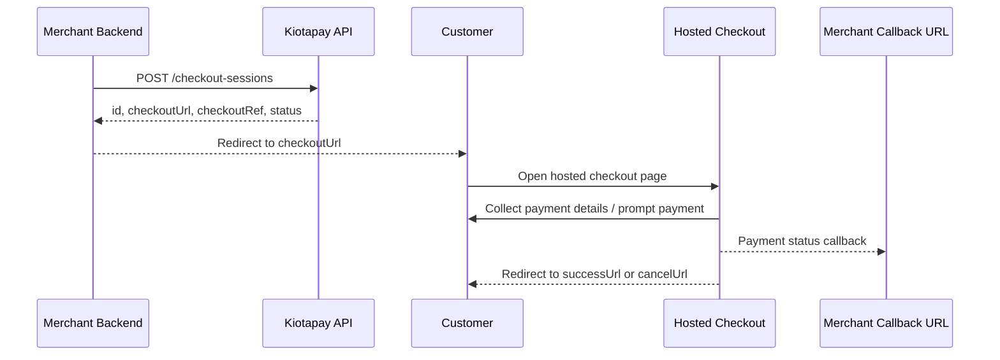

## Overview

Use this endpoint to create a hosted checkout session for your customer. Kiotapay returns a **checkout URL** that you can redirect the customer to, open in a browser, or present as a pay button link inside your app.

This is useful when you want Kiotapay to handle the payment collection flow for methods such as:

* **CARD**
* **MPESA_STK**

Once the session is created, your system receives a response containing:

* a public checkout session ID
* a unique checkout reference
* the hosted checkout URL
* the current status of the session

---

## Endpoint

`POST https://api.kiotapay.co/api/sandbox/v1/checkout-sessions`

> Use the sandbox base URL for testing. Switch to your production base URL when you go live.

---

## Authentication

Send your bearer token in the `Authorization` header.

```bash
Authorization: Bearer <your_access_token>
```

---

## Headers

<ParamField header="Authorization" type="string" required>
Bearer token used to authenticate your API request.
</ParamField>

<ParamField header="Content-Type" type="string" required>
Must be `application/json`.
</ParamField>

---

## Request body

<ParamField body="amount" type="number" required>
Amount to be charged. Provide the full monetary amount in the currency specified.
</ParamField>

<ParamField body="currency" type="string" required>
Three-letter currency code. Example: `KES`.
</ParamField>

<ParamField body="description" type="string" required>
Human-readable description of the payment. Example: `Payment for order #12345`.
</ParamField>

<ParamField body="successUrl" type="string" required>
URL where the customer should be redirected after a successful payment.
</ParamField>

<ParamField body="cancelUrl" type="string" required>
URL where the customer should be redirected if they cancel the payment flow.
</ParamField>

<ParamField body="paymentMethods" type="array[string]" required>
List of allowed payment methods for this checkout session. Example: `["CARD", "MPESA_STK"]`.
</ParamField>

<ParamField body="externalReference" type="string">
Your own external reference for reconciliation, such as an order ID.
</ParamField>

<ParamField body="customerEmail" type="string">
Customer email address.
</ParamField>

<ParamField body="customerPhone" type="string">
Customer phone number in international format. Example: `+237612345678`.
</ParamField>

<ParamField body="paymentReference" type="string">
Reference shown or associated with the payment. Often this matches your order or invoice reference.
</ParamField>

<ParamField body="callbackUrl" type="string">
Webhook URL that Kiotapay can notify with payment updates for this checkout session.
</ParamField>

---

## Example request

```bash
curl --location 'https://api.kiotapay.co/api/sandbox/v1/checkout-sessions' \
--header 'Device-Id: example-my-device-id' \
--header 'Content-Type: application/json' \
--header 'Authorization: Bearer <your_access_token>' \
--data-raw '{
  "amount": 1500,
  "currency": "KES",
  "description": "Payment for order #12345",
  "successUrl": "https://portal.example.com/checkout/success",
  "cancelUrl": "https://portal.example.com/checkout/cancel",
  "paymentMethods": ["CARD", "MPESA_STK"],
  "externalReference": "ORDER-12345-EXT",
  "customerEmail": "customer@example.com",
  "customerPhone": "+237612345678",
  "paymentReference": "ORDER-12345-EXT",
  "callbackUrl": "https://webhook.site/dd1b4efd-a1a7-4aac-9b23-0dc13dec525f"
}'
```

---

## Example response

```json
{
  "id": "1f1f7d84-5a65-4f76-98bc-c7c50dbe1234",
  "checkoutUrl": "https://checkout.kiotapay.co/session/chk_01JXYZABCDEFG123456",
  "checkoutRef": "CHK-20260316-000123",
  "status": "PENDING"
}
```

---

## Response fields

<ParamField body="id" type="uuid">
Public checkout session ID.
</ParamField>

<ParamField body="checkoutUrl" type="string">
Hosted Kiotapay checkout URL. Redirect your customer to this link to complete payment.
</ParamField>

<ParamField body="checkoutRef" type="string">
Unique Kiotapay checkout reference for support, reconciliation, and tracking.
</ParamField>

<ParamField body="status" type="enum">
Current status of the checkout session.
</ParamField>

---

## Checkout session statuses

<ParamField body="PENDING" type="string">
The checkout session has been created and is waiting for the customer to start or complete payment.
</ParamField>

<ParamField body="REQUIRES_CUSTOMER_ACTION" type="string">
The payment needs an additional step from the customer, such as completing card authentication or approving an STK prompt.
</ParamField>

<ParamField body="PROCESSING" type="string">
The payment is being processed.
</ParamField>

<ParamField body="SUCCEEDED" type="string">
The payment completed successfully.
</ParamField>

<ParamField body="FAILED" type="string">
The payment failed.
</ParamField>

<ParamField body="EXPIRED" type="string">
The checkout session expired before payment was completed.
</ParamField>

---

## How it works

<Steps>
  <Step title="Create a checkout session">
    Call the endpoint with the payment details, redirect URLs, customer details, and allowed payment methods.
  </Step>
  <Step title="Receive the checkout URL">
    Kiotapay returns a `checkoutUrl` in the response.
  </Step>
  <Step title="Redirect or open the page">
    Send the customer to the hosted checkout page using the returned URL.
  </Step>
  <Step title="Track payment result">
    Use your `successUrl`, `cancelUrl`, and optional `callbackUrl` to track the final outcome.
  </Step>
</Steps>

---

## Redirect example

After creating the checkout session on your backend, send the returned `checkoutUrl` to your frontend and redirect the user.

```javascript
window.location.href = checkoutUrl;
```

---

## Best practices

* Always generate a unique `externalReference` for each order or invoice.
* Store the returned `id` and `checkoutRef` in your database for reconciliation.
* Prefer using a `callbackUrl` so your backend can receive asynchronous payment updates.
* Do not rely only on frontend redirects for final payment confirmation.
* Validate that the final payment status is `SUCCEEDED` before fulfilling an order.

---

## Notes

* `checkoutUrl` is the main link your customer should open to complete payment.
* `successUrl` and `cancelUrl` are customer-facing redirect URLs.
* `callbackUrl` is intended for server-to-server notifications.
* The initial returned `status` may be `PENDING`, even though the payment later moves to another state.

---

## Sample integration flow



---

## Error handling

Your integration should be prepared to handle standard API errors such as:

* invalid authentication token
* missing required headers
* invalid payload fields
* unsupported payment methods
* invalid callback or redirect URLs

A typical error response may look like:

```json
{
  "message": "Invalid request payload",
  "errors": {
    "amount": ["amount must be greater than 0"],
    "currency": ["currency is required"]
  }
}
```

---

## Full request schema

```json
{
  "amount": 1500,
  "currency": "KES",
  "description": "Payment for order #12345",
  "successUrl": "https://portal.example.com/checkout/success",
  "cancelUrl": "https://portal.example.com/checkout/cancel",
  "paymentMethods": ["CARD", "MPESA_STK"],
  "externalReference": "ORDER-12345-EXT",
  "customerEmail": "customer@example.com",
  "customerPhone": "+237612345678",
  "paymentReference": "ORDER-12345-EXT",
  "callbackUrl": "https://merchant.example.com/api/webhooks/kiotapay"
}
```

## Full response schema

```json
{
  "id": "uuid",
  "checkoutUrl": "string",
  "checkoutRef": "string",
  "status": "PENDING | REQUIRES_CUSTOMER_ACTION | PROCESSING | SUCCEEDED | FAILED | EXPIRED"
}
```
